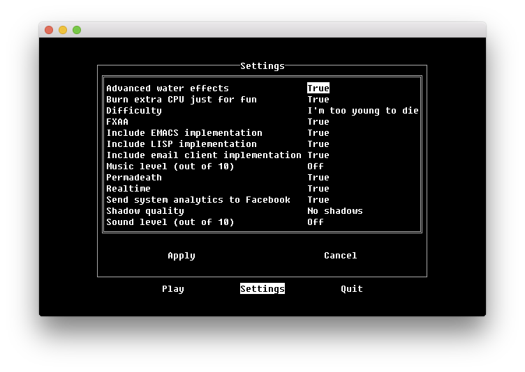

clubsandwich
============

**A roguelike framework for Python 3 using**
`BearLibTerminal <http://foo.wyrd.name/en:bearlibterminal>`_

`Source code <https://github.com/irskep/clubsandwich>`_

`API docs <http://steveasleep.com/clubsandwich/>`_

What is this?
-------------

Imagine you want to write a roguelike, you don't want to roll your own
framework from scratch, and you want to use Python.

The most mature option for doing this is
`libtcod-cffi <https://pypi.python.org/pypi/libtcod-cffi>`_, which is a
kitchen sink of roguelike development utilities like terminal graphics,
pathfinding, random numbers, noise generators, config file parsers, and data
structures. But it's pretty heavy, the docs aren't great, and it's an icky
C API. And while it covers a lot of things you need for a roguelike, it doesn't
help you much with your UI or state management.

If that sounds like a decent tradeoff, go try ``libtcod-cffi`` and be happy!
But there's another library,
`BearLibTerminal <http://foo.wyrd.name/en:bearlibterminal>`_, that only
handles terminal graphics. It's tiny and understandable. Clubsandwich
builds on BearLibTerminal (BLT...) to add a nice API, state management, easy
UI, and some other helpful stuff.

Features
~~~~~~~~

Scroll down for examples.

* Event loop
* Scene manager
* Geometry data structures
* Convenience functions
* UIKit-like interface framework
* Script runner to help you iterate quickly

Dependencies
~~~~~~~~~~~~

* Python 3.4+
* And BearLibTerminal, of course

Installation
------------

This package is not yet on PyPI. It is under heavy development. But you can
expect reasonable API stability!

.. code:: python

    pip install -e 'git://github.com/irskep/clubsandwich.git@master#egg=clubsandwich'

.. image:: readme_images/screenshot1.png

Feature examples
----------------

An event loop
~~~~~~~~~~~~~

``terminal_update()`` is called every frame.  The ``terminal_read(val)`` method
is called whenever events are in the queue.

.. code:: python

    from clubsandwich.blt.loop import BearLibTerminalEventLoop

    class BasicLoop(BearLibTerminalEventLoop):
        def terminal_read(self, val):
            print("User pressed a key:", val)

        def terminal_update(self):
            # this is called every frame
            return True

    if __name__ == '__main__':
        BasicLoop().run()

A scene manager
~~~~~~~~~~~~~~~

Most games have more than one screen! This simple "director" object manages
them for you in a really obvious way.

.. code:: python

    from bearlibterminal import terminal
    from clubsandwich.director import DirectorLoop, Scene

    class BasicLoop2(DirectorLoop):
        def get_initial_scene(self):
            return MainMenuScene()

    class MainMenuScene(Scene):
        def terminal_update(self, is_active=False):
            print(0, 0, "Press Enter to begin game, Esc to quit")

        def terminal_read(self, val):
            if val == terminal.TK_ENTER:
                self.director.push_scene(GameScene())
            elif val == terminal.TK_ESCAPE:
                self.director.pop_scene()

    class GameScene(Scene):
        def terminal_update(self, is_active=False):
            print(0, 0, "You are playing the game, it is so fun! Press Esc to stop.")

        def terminal_read(self, val):
            if val == terminal.TK_ESCAPE:
                self.director.pop_scene()

    if __name__ == '__main__':
        BasicLoop2().run()

A geometry library
~~~~~~~~~~~~~~~~~~

Basic data structures for ``Rect``, ``Point``, and ``Size``, and a very thin
wrapper around ``bearlibterminal.terminal`` to support them.

.. code:: python

    from clubsandwich.blt.nice_terminal import terminal
    from clubsandwich.geom import Rect, Size, Point

    terminal.open()
    terminal.bkcolor('#ff0000')
    terminal.clear_area(Rect(Point(2, 2), Size(10, 10)))
    terminal.refresh()
    terminal.read()
    terminal.close()

Convenient terminal state access
~~~~~~~~~~~~~~~~~~~~~~~~~~~~~~~~

A super simple wrapper around ``terminal.state()`` to conveniently read state
values.

.. code:: python

    from clubsandwich.blt.state import blt_state
    from clubsandwich.blt.nice_terminal import terminal
    from clubsandwich.geom import Rect, Size, Point

    terminal.open()
    terminal.bkcolor('#ff0000')
    terminal.clear_area(Rect(Point(2, 2), Size(10, 10)))
    terminal.refresh()
    # less verbose than terminal.state(terminal.TK_ESCAPE)!
    while not blt_state.escape:
    terminal.read()
    terminal.close()

Transform stack
~~~~~~~~~~~~~~~

Easily translate view coordinates between frames of reference.

.. code:: python

    from clubsandwich.blt.state import blt_state
    from clubsandwich.blt.context import BearLibTerminalContext
    from clubsandwich.geom import Rect, Size, Point

    terminal = BearLibTerminalContext()

    terminal.open()
    terminal.bkcolor('#ff0000')
    with terminal.translate(Point(blt_state.width, blt_state.height)):
    terminal.clear_area(Rect(Point(2, 2), Size(10, 10)))
    terminal.refresh()
    # less verbose than terminal.state(terminal.TK_ESCAPE)!
    while not blt_state.escape:
    terminal.read()
    terminal.close()

A UIKit-like user interface library
~~~~~~~~~~~~~~~~~~~~~~~~~~~~~~~~~~~

This is too sophisticated for a short demo, but here's the code for the scene
in the first screenshot:

.. code:: python

    from clubsandwich.director import DirectorLoop
    from clubsandwich.ui import (
        LabelView,
        ButtonView,
        UIScene,
        LayoutOptions
    )

    LOGO = """
      _______     __     ____             __       _     __
     / ___/ /_ __/ /    / __/__ ____  ___/ /    __(_)___/ /
    / /__/ / // / _ \  _\ \/ _ `/ _ \/ _  / |/|/ / / __/ _ \\
    \___/_/\_,_/_.__/ /___/\_,_/_//_/\_,_/|__,__/_/\__/_//_/
    """

    class BasicLoop(DirectorLoop):
        def get_initial_scene(self):
            return MainMenuScene()

    class MainMenuScene(UIScene):
        def __init__(self, *args, **kwargs):
            views = [
                LabelView(
                    LOGO[1:].rstrip(),
                    layout_options=LayoutOptions.row_top(0.5)),
                LabelView(
                    "Try resizing the window!",
                    layout_options=LayoutOptions.centered('intrinsic', 'intrinsic')),
                ButtonView(
                    text="Play", callback=self.play,
                    layout_options=LayoutOptions.row_bottom(4).with_updates(
                        left=0.2, width=0.2, right=None)),
                ButtonView(
                    text="Settings", callback=self.show_settings,
                    layout_options=LayoutOptions.row_bottom(4).with_updates(
                        left=0.4, width=0.2, right=None)),
                ButtonView(
                    text="Quit", callback=lambda: self.director.pop_scene(),
                    layout_options=LayoutOptions.row_bottom(4).with_updates(
                        left=0.6, width=0.2, right=None)),
            ]
            super().__init__(views, *args, **kwargs)

        def play(self):
            self.director.push_scene(CharacterCreationScene())

        def show_settings(self):
            self.director.push_scene(SettingsScene())

    if __name__ == '__main__':
        BasicLoop().run()

Script runner
~~~~~~~~~~~~~

When you install clubsandwich, it adds a script called ``babysit`` to your
path. This script does one very simple thing: it runs a command, and when that
command exits, it runs it again. This repeats until you Ctrl+C the ``babysit``
process.

This is useful when writing games because you don't want to have to keep
switching back to your terminal to run your script. Using ``babysit``, you can
just quit your game whenever you make a change and it'll start back up again.

You can try it with the demo script like this:

.. code:: sh

    babysit python demo.py